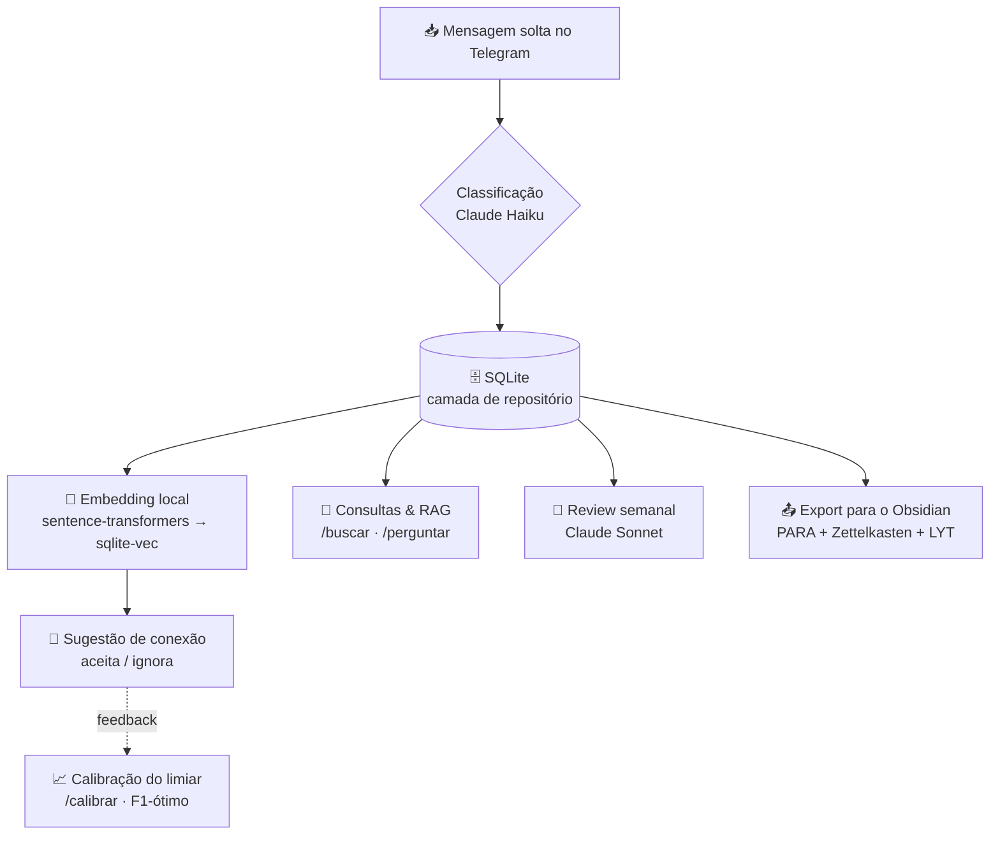

<h1 align="center">🧠 Nexus — Personal Organizer Bot</h1>

<p align="center">
  <em>Seu segundo cérebro no Telegram: mande a vida em mensagens soltas — a IA classifica,
  organiza, conecta e te devolve insights.</em>
</p>

<p align="center">
  
  
  
  
  
</p>

---

## 💡 A ideia

Ao longo do dia batem ideias, tarefas, compromissos e anotações — e quase sempre elas se perdem.
O **Nexus** é um agente pessoal que você alimenta com **mensagens soltas** no Telegram. Ele:

1. **Classifica** cada mensagem com IA (tipo, título, prazo, prioridade, projeto, pessoas);
2. **Guarda** tudo de forma estruturada no SQLite;
3. **Conecta** notas parecidas e sugere links;
4. **Responde** perguntas e gera **insights** sobre a sua rotina;
5. **Exporta** um vault navegável para o Obsidian.

Tudo com uma regra de ouro: **a IA nunca inventa** prazo, prioridade ou fato que não esteja no texto.

## 🌊 Como funciona



## ✨ Destaques

- 🤖 **Classificação estruturada** com Claude Haiku (*structured output*) em **tarefa · evento ·
  acontecimento · ideia · nota**, com **aprendizado incremental**: cada correção sua vira *few-shot*
  nas próximas classificações. (📔 *Acontecimento* = um registro pessoal/emocional — algo que te
  aconteceu e mexeu com você.)
- 🧭 **Memória semântica local** — embeddings offline (`sentence-transformers`) + `sqlite-vec` no
  próprio banco, **sem custo de API**. Ao salvar uma nota, o bot sugere conexões com as parecidas.
- 💬 **RAG conversacional** (`/perguntar`) — pergunte em linguagem natural e receba respostas
  **ancoradas nas suas notas**, citando `#id` e data.
- ✍️ **Edição em linguagem natural** (`/editar`) — *"adia o relatório pra sexta e marca alta"*;
  o bot descobre **qual** entrada e o que mudar.
- 🔮 **Insights proativos** — `/review` semanal com Claude Sonnet e envio **automático** agendado
  quando o histórico fica rico o bastante.
- 📈 **Ciclo de ML fechado** — `/calibrar` aprende o limiar de conexões a partir do seu próprio
  feedback (coleta → treino → uso).
- 🗂️ **Export para Obsidian** idempotente, num híbrido **PARA + Zettelkasten + LYT/MOCs**.
- 🔒 **Privado por padrão** — restrito ao seu `chat_id`; nenhum dado pessoal vai para o repositório.

## 💬 Comandos

Basta **enviar qualquer texto** para capturar e classificar uma entrada. Os comandos abaixo aparecem
no menu do Telegram:

| Comando | O que faz |
| --- | --- |
| *(qualquer texto)* | Captura, **classifica com IA** e responde com um card + botões de correção (✅ / ✏️) |
| `/start` | Mensagem de boas-vindas |
| `/tarefas` | Tarefas abertas, ordenadas por prazo e prioridade (botão ✔️ **Concluir** em cada) |
| `/dia` | O que é **para hoje**: tarefas com prazo hoje + atrasadas (⚠️) e eventos do dia |
| `/hoje` | Entradas **criadas** hoje |
| `/ideias` · `/eventos` · `/acontecimentos` | Lista as entradas por tipo (💡 ideias, 📅 eventos, 📔 acontecimentos pessoais) |
| `/buscar <termo>` | **Busca por significado**: match exato + vizinhos semânticos filtrados pelo Haiku |
| `/perguntar <pergunta>` | **RAG**: responde ancorado nas suas notas (Sonnet), citando `#id`/data |
| `/editar <instrução>` | **Edição natural**: descobre a entrada pelo texto (ou use `/editar #<id> …`) |
| `/review` | **Análise da semana** (Sonnet): tarefas adiadas, temas em alta, ideias órfãs, rotina |
| `/calibrar` | Aprende o **limiar de conexões** a partir do seu feedback (F1-ótimo) |
| `/export` | Exporta tudo para um **vault do Obsidian** (PARA + Zettelkasten + LYT) |

## 🛠️ Stack

| Camada | Tecnologia |
| --- | --- |
| **Captura** | `python-telegram-bot` (async) + `JobQueue` (APScheduler) para o review agendado |
| **Persistência** | SQLite + SQLAlchemy 2 atrás de uma **camada de repositório** (migração p/ Postgres fácil) |
| **IA** | Anthropic Claude — **Haiku** (`claude-haiku-4-5`): classificação, busca, edição · **Sonnet** (`claude-sonnet-5`): review e RAG |
| **Busca semântica** | `sentence-transformers` (local, offline) + `sqlite-vec` |
| **Config & schemas** | `pydantic` · `pydantic-settings` · `python-dotenv` |
| **Export** | Markdown + *frontmatter* YAML (Obsidian) |
| **Testes** | `pytest` (62, com o LLM mockado — sem rede) |

## 🚀 Setup

> Requer **Python 3.11+**.

```bash
# 1. Ambiente virtual
python -m venv .venv
.venv\Scripts\Activate.ps1        # Windows (PowerShell)
# source .venv/bin/activate       # Linux/macOS

# 2. Instalar em modo editável (com deps de dev)
pip install -e ".[dev]"

# 3. Variáveis de ambiente
copy .env.example .env            # Windows  (cp no Linux/macOS)
```

Edite o `.env`:

| Variável | Descrição |
| --- | --- |
| `TELEGRAM_BOT_TOKEN` | Token do bot, criado com o [@BotFather](https://t.me/BotFather) |
| `ANTHROPIC_API_KEY` | Chave da API da Anthropic |
| `ALLOWED_CHAT_ID` | Seu `chat_id` numérico (o bot ignora qualquer outro chat). Descubra com o [@userinfobot](https://t.me/userinfobot) ou no log ao enviar uma mensagem |

As demais opções (busca semântica, limiares, review semanal, fuso) têm **padrões sensatos** e estão
documentadas no `.env.example`.

```bash
# Rodar
python -m organizer.main
```

No Telegram, envie `/start` e depois qualquer mensagem. O bot responde com um **card-resumo** da
classificação e botões de correção — cada correção é gravada e reinjetada como *few-shot*.

## 🗂️ Export para o Obsidian

`/export` (ou `python -m organizer.export`) gera, de forma **idempotente** e **sem custo de API**, um
vault num híbrido **PARA + Zettelkasten + LYT/MOCs** — pensado para *poucos links, todos com significado*:

```
Home.md                        # MOC-raiz (LYT): liga todas as seções
Projects/<slug>.md             # PARA · trabalho acionável por projeto
Areas/Tarefas.md · Agenda.md   # PARA · tarefas abertas e eventos
Areas/People/<nome>.md         # PARA · MOC por pessoa
Resources/Ideias · Notas · Acontecimentos · Reviews.md   # PARA · conhecimento, acontecimentos e reviews
Archive/Concluidas.md          # PARA · tarefas concluídas
Journal/YYYY-MM-DD.md          # log cronológico do dia
Slipbox/<id>-<slug>.md         # Zettelkasten: 1 nota atômica por entrada
```

Cada nota atômica tem **frontmatter YAML** (id, tipo, status, prazo, prioridade, projeto, pessoas,
tags) e, no corpo, só links com significado: um **up-link** para o MOC-lar (garante o grafo conectado),
o projeto, as pessoas e as **conexões aceitas**. O vault fica fora do git — **nenhum dado pessoal
vai para o repositório**.

## 🧠 Decisões de IA

- **Haiku para o barato e frequente** (classificar, buscar, editar); **Sonnet para o analítico**
  (review semanal, RAG) — equilíbrio custo × qualidade.
- **Anti-alucinação em todos os prompts**: campos não inferíveis ficam `null`; respostas do RAG e do
  review são **ancoradas** nos dados e citam a fonte.
- **Structured output** (pydantic) para classificação, busca e edição — parsing confiável e testável.
- **Embeddings locais**: privacidade e custo zero na memória semântica; a API só entra quando agrega valor.

## 🧪 Testes

```bash
pytest
```

62 testes cobrindo repositório, parsers dos modelos (LLM **mockado**, sem rede), consultas, export,
edição, RAG e calibração.

## 🛣️ Roadmap — 100% concluído

| # | Fase | Entrega |
| --- | --- | --- |
| 1 | Fundação | ✅ Bot Telegram + persistência SQLite (captura crua) |
| 2 | Classificação | ✅ Claude Haiku + correções (*few-shot*) + mini-eval de acurácia |
| 3 | Consultas | ✅ `/tarefas` `/hoje` `/ideias` `/eventos` `/buscar` + concluir |
| 4 | Export | ✅ Obsidian (PARA + Zettelkasten + LYT/MOCs, idempotente) |
| 5 | Memória semântica | ✅ Embeddings locais + sqlite-vec, conexões e busca híbrida |
| 6 | Insights | ✅ `/review` semanal (Sonnet) + proatividade agendada (JobQueue) |
| 7 | Tarefas do dia | ✅ `/dia` — prazo hoje/atrasadas + eventos |
| 8 | Edição natural | ✅ `/editar` com resolução automática da entrada |
| 9 | RAG | ✅ `/perguntar` — perguntas ancoradas nas notas |
| 10 | Calibração | ✅ `/calibrar` — limiar de conexões aprendido do feedback (F1-ótimo) |

### 🔭 Próximos passos (ideias)

🎙️ entrada por **áudio/foto** (Whisper / visão) · 🏗️ **CI** (GitHub Actions + `ruff`) ·
📊 **gráficos** no review · 🐘 migração para **Postgres + Alembic** · 💬 **memória de conversa** no `/perguntar`.

---

<p align="center">
  Feito como projeto de portfólio · foco em <strong>IA aplicada</strong> e <strong>backend</strong>.
  <br>
  <sub>Licença: a definir (sugestão: MIT).</sub>
</p>
